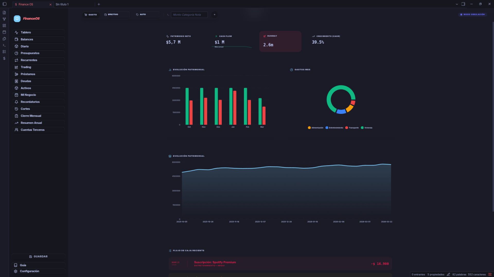
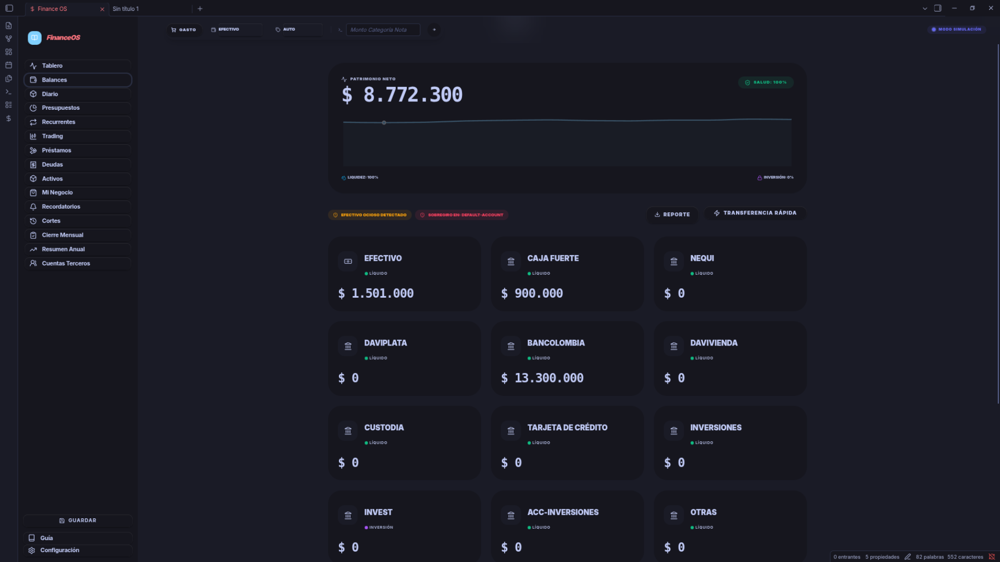
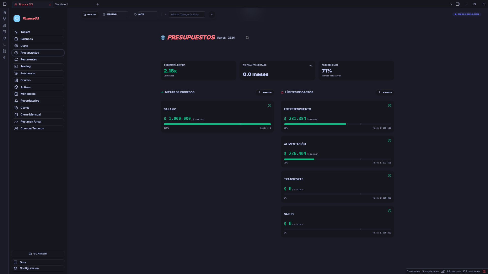
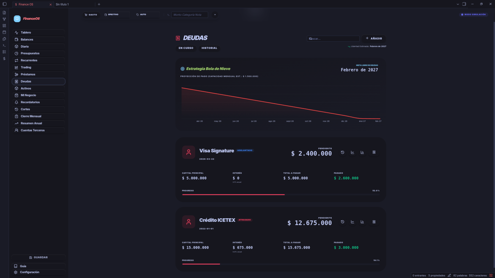

# Finance OS - Gestión de Finanzas Personales en Obsidian

**Versión:** 2.3.0  
**Autor:** Andres Vega  
**Estado:** 🚀 Producción | Optimizado para Obsidian

---

**Finance OS** es un ecosistema financiero integral diseñado para ejecutarse dentro de **Obsidian**. Está enfocado en proporcionar a todo tipo de usuarios un control absoluto sobre su salud financiera, desde el seguimiento de gastos diarios hasta la planificación de estrategias de deuda a largo plazo.

Este plugin combina la flexibilidad de las notas en Markdown con la potencia de una base de datos financiera granular y analítica avanzada mediante IA.

---

## 📸 Vista Previa

| **Tablero Principal** | **Balances y Cuentas** |
|:---:|:---:|
|  |  |
| **Presupuestos y Metas** | **Estrategia de Deudas** |
|  |  |


---

## ✨ Módulos Destacados

### 📓 Registro Diario Premium
- **Interfaz de Alto Nivel**: Visualización limpia con filtros avanzados por cuenta, categoría y periodo de tiempo.
- **Gráficos en Tiempo Real**: Análisis de flujo de caja diario para detectar fugas de capital y optimizar ahorros.
- **Categorización Inteligente**: Sistema taxonómico flexible para gastos esenciales, discrecionales e inversiones.

### 🏦 Gestión de Activos y Cuentas
- **Control Multi-Cuenta**: Administra efectivo, cuentas bancarias, billeteras digitales y cajas fuertes en un solo lugar.
- **Balances Consolidados**: Seguimiento automático de tu patrimonio neto (Net Worth) basado en tus saldos actuales.

### 📈 Presupuestos y Estrategia
- **Metas de Ingresos y Gastos**: Define límites mensuales por categoría para mantener tus finanzas bajo control.
- **Estrategia de Deudas (Snowball/Avalanche)**: Visualiza el progreso de tus pagos y proyecciones de libertad financiera.

---

## 🚀 Instalación Especializada

Como este plugin está en fase avanzada de desarrollo con **Tailwind CSS**, asegúrate de seguir estos pasos para producción:

1. Descarga el `main.js`, `manifest.json` y `styles.css`.
2. Ubícalos en su propia carpeta dentro de tu vault: `<Vault>/.obsidian/plugins/finance-os-plugin2/`.
3. Reinicia Obsidian y activa el plugin.

### Desarrollo y Build
Si deseas modificar el código o compilarlo tú mismo:
```bash
npm install        # Instala dependencias y Tailwind
npm run build      # Genera los archivos optimizados
```

---

## 📂 Estructura del Almacén de Datos

Tus datos son tuyos. Finance OS guarda todo de forma local en formato JSON legible en la carpeta oculta `.finance-db/`:

- `core/summaries.json`: Resúmenes de alto nivel y KPIs financieros.
- `ledger/`: Carpeta con transacciones históricas organizadas de forma granular por mes.

---

## 🛠️ Tecnologías Utilizadas

- **Core**: TypeScript + React.
- **Estilos**: Tailwind CSS (Premium Design System).
- **Icons**: Lucide React.
- **Bundler**: esbuild.

---

## 🎯 Hoja de Ruta

- [x] **Fase 1: Control de Gastos y Presupuestos** (Completado)
- [ ] **Fase 2: Gestión de Inversiones y Portafolio** (En desarrollo)
- [ ] **Fase 3: Reportes Avanzados e IA** (Planificado)

---

> [!TIP]
> **Privacidad Primero**: Finance OS funciona 100% offline. Tus datos nunca salen de tu bóveda de Obsidian a menos que tú decidas exportarlos.

---
**Desarrollado con pasión para la gestión financiera moderna.**

---

## 📄 Licencia

Este proyecto está bajo la Licencia **ISC** (Permisiva). Consulta el archivo [LICENSE](LICENSE) para más detalles.

---

## 💎 Support and Services

Found **Habit Loop Tracker** useful? I accept donations that go toward future development efforts. For this hobby project, I don't accept payments for bug bounties or feature requests to avoid additional pressure.

However, **if you need a specific and custom Obsidian project**, you can also contact me for professional development services.

### Support development or contact me!

<a href='https://ko-fi.com/D1D61W9BNO' target='_blank'></a>
[](https://paypal.me/AndresFelipeVH)